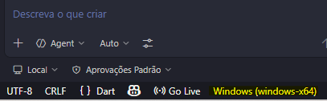
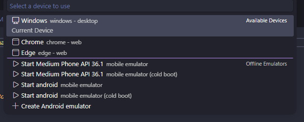

# alcool gasolina

- Criando um novo projeto flutter
~~~bash
flutter create --org (nome da sua empresa) alcool_gasolina
~~~
- Entrando no diretorio
~~~bash
cd alcool_gasolina
~~~
Navegar até a pasta lib e modificar o arquivo main.dart

- Teste o app, no terminal execulte o comando
~~~bash
flutter run
~~~
## Depois escolha em qual device vai ser execultado 
Connected devices: 
Windows (desktop) • windows • windows-x64    • Microsoft Windows [versÆo 10.0.26200.8116] 
Chrome (web)      • chrome  • web-javascript • Google Chrome 146.0.7680.165 
Edge (web)        • edge    • web-javascript • Microsoft Edge 146.0.3856.84 
[1]: Windows (windows) 
[2]: Chrome (chrome) 
[3]: Edge (edge) 
Please choose one (or "q" to quit):  

## Mudando para Mobile

- No canto inferior direito clicar em Windows (windows-x64) 

Depois escolher qual api vai ser utilizada, ou criar um novo android emulador